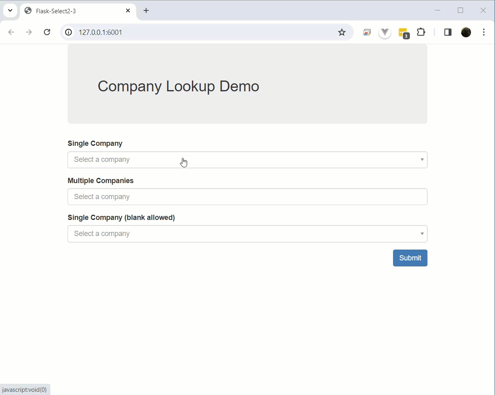

Simple example using SQlAlchemy 'ilike' to perform the filtering.

Illustrates using single select and multiple select.

```
cd examples/basic

flask build-sample-db
flask run -p 6001
 * Serving Flask app 'app/__init__.py'
 * Debug mode: off
WARNING: This is a development server. Do not use it in a production deployment. Use a production WSGI server instead.
 * Running on http://127.0.0.1:6001                                                                                   
Press CTRL+C to quit                 
```
